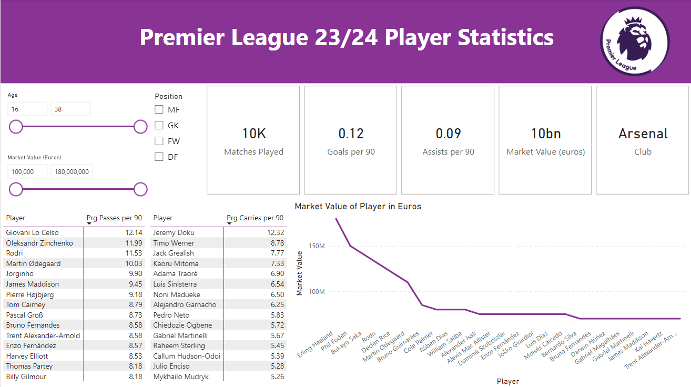

# Premier League 23-24 

## Objective: 
Explored, cleaned and transformed data in SQL and built a dashboard using Power BI to visualize trends related to key indicators of player performance. Analysis was conducted on different datasets relating to premier player information, statistics and footballing market value. Dashboard geared towards clubs and scouting departments to generate shortlists for recommendations for future transfers.


## Data Sources
All data was sourced from Kaggle
Football Data from Transfermarkt
Premier Player Stats 23/24

Tools used:
| Tool | Use |
| --- | --- |
| Sql Server | Cleaning, testing, and analyzing the data |
| Power BI | Visualizing the data via interactive dashboards |

## Steps
1. Scrape data
2. Explore, load and clean and transform data in SQL
3. Visualize data with Power Bi
4. Generate findings based on insight
5. Document findings

## Data Loading and Cleaning
The relevant tables were loaded onto the server and then cleaned to only contain the relevant columns. Where statements were used to reduce clubs to only in the premier league in the 23/24 seasons and then left joins were used to join the tables so a combined table with the players, their clubs and transfer valuations were combined.

```sql
select first_name, last_name, current_club_id, current_club_name, market_value_in_eur, c.name
from dbo.players p
left join clubs c
on p.current_club_id = c.club_id
where p.current_club_domestic_competition_id = 'GB1' and p.last_season = '2023'
```

## Data Transformation
Next, case statements split the names on the premier league table so they can be both used to join the two tables together. Using club name and player name columns to join help reduces the chances of duplicates from players who have the same name. 

```sql
with PlayerData as (
select first_name, last_name, current_club_id, current_club_name, market_value_in_eur, c.name
from dbo.players p
left join clubs c
on p.current_club_id = c.club_id
where p.current_club_domestic_competition_id = 'GB1' and p.last_season = '2023'
 ),

LeaguePlayers as (
select *,
case
	when CHARINDEX(' ', Player) > 0
	then left(Player, CHARINDEX(' ', Player) - 1)
	else null
	end as first_name,
case
	WHEN CHARINDEX(' ', Player) > 0
    	THEN RIGHT(Player, LEN(Player) - CHARINDEX(' ', Player))
    	ELSE Player
	END AS last_name
from [premier-player-23-24]
)


select Player, Pos, Age, MP, Min, _90s, Gls, Ast, PrgC, PrgP, PrgR, Gls_90, Ast_90, market_value_in_eur, pd.name
FROM
	PlayerData pd
JOIN
	LeaguePlayers pp
ON
	pd.last_name = pp.last_name and pp.Team = pd.name
order by pp.Player
```

## Visualization:


## DAX Measures
#### Progressive Carries per 90
```DAX
PrgC_90s = CALCULATE(SUM(PremStats[PrgC])/SUM(PremStats[_90s]),Filter(PremStats,PremStats[MP] >=10))
```

#### Progressive Passes per 90
```DAX
PrgP_90s = CALCULATE(SUM(PremStats[PrgP])/SUM(PremStats[_90s]),FILTER(PremStats,PremStats[MP] >= 10))
```

#### Progressive Runs per 90
```DAX
PrgR_90s = sum(PremStats[PrgR])/SUM(PremStats[_90s])
```

